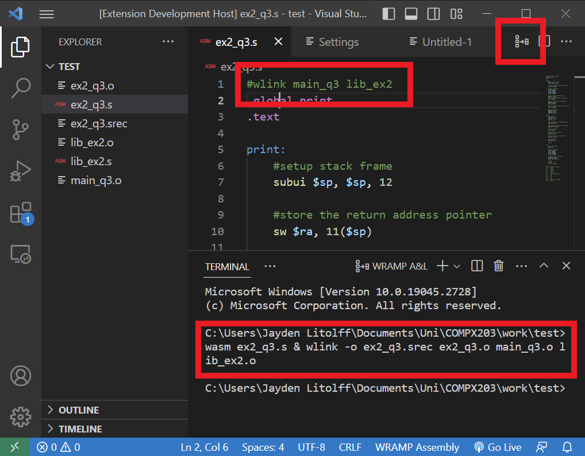

# WRAMP Assembly Intellisense

This extension implements the provideHover and provideCompletionItems functions of IntelliSense into the editor for the WRAMP Assembly language. 
It also provides an "Assemble & Link" button in the editor titlebar menu.

WRAMP was developed by the University of Waikato as an easy-to-learn architecture for teaching assembly language and basic processor concepts.

## Features

Intellisense input suggestions will appear which contain all WRAMP Instruction set commands, as well as directives. The suggestions have accompanying documentation and use snippet strings which create input fields when needed, which can be tabbed between.

Commands, Directives and system registers also have documentation which will display upon hover. Includes command parameters, type and function explanations.

When in a WRAMP assembly file, a compile code button will be visible in the file header menu. By default this will run wasm assemble the current file and then link the single file into an srec. To specify any additional files which should be assembled at the same time as the current file (.s to .o), add this comment to the top of your file:

```
#wasm additionalFile1 additionalFile2
```
(Dont include file extensions. Don't add the current file to this comment, it will be done by default)

To specify any additional files which should be linked to your assembled code (.o to .srec) add this comment at the top of your file. (Same syntax as wasm)
```
#wlink otherCodeFile LibraryFile
```




<br>
*directive suggestions*<br>
<br>
*inserted snippet string*


*directive hover*

*instruction hover*

*register hover*

## Notes

based on (vaguely) https://github.com/microsoft/vscode-extension-samples/tree/main/completions-sample

if developing follow install instructions from here https://github.com/microsoft/vscode-extension-samples/

Usage
1. git clone https://github.com/JayBigGuy10/WRAMP-Assembly-Intellisense
2. npm install in the terminal, 
3. then F5 to run the sample


thanks to [stackoverflow.com/67749752/](https://stackoverflow.com/questions/67749752/how-to-apply-styling-and-html-tags-on-hover-message-with-vscode-api)
and [stackoverflow.com//54792391/](
https://stackoverflow.com/questions/54792391/vs-code-hover-extension-implement-hoverprovider) for providing needed usage contex

https://code.visualstudio.com/api/working-with-extensions/publishing-extension

https://code.visualstudio.com/api/language-extensions/programmatic-language-features#show-hovers

https://code.visualstudio.com/api/references/vscode-api#languages.registerCompletionItemProvider

### `vscode` module

- [`languages.registerCompletionItemProvider`](https://code.visualstudio.com/api/references/vscode-api#languages.registerCompletionItemProvider)
- [`languages.registerHoverProvider`](https://code.visualstudio.com/api/references/vscode-api#languages.registerHoverProvider)

find the published extension here: https://marketplace.visualstudio.com/items?itemName=JLitolff-WaikatoUni.wramp-assembly-intellisense


